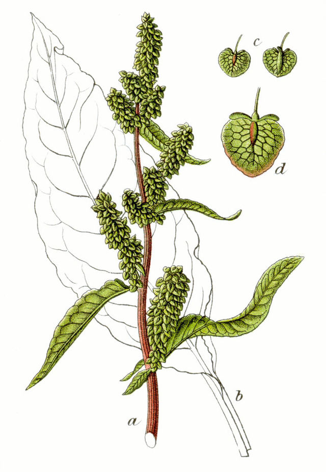

# Dockweed

<picture></picture>

Dockweed is a library (and possibly application) for creating and running directed acyclic graphs (DAGs)
of Docker containers. These graphs can be used for general workflows and for optimisation.

Dockweed is (more-or-less) an exercise for myself in using containers. It also develops some ideas I have
about defining and running DAG pipelines in an "extensible" manner. These ideas go back to a project
I was on at Enthought and can be summarised as:
- To be able to define DAGs declaratively rather than imperatively, in a form that can be 
  specified as a JSON.
- To be able to define connections (edges) between containers (nodes) in an adaptable, imperative fashion.
- To automatically determine node run order by topological sorting.
- To be able to run DAGs with random inputs for Monte-Carlo simulation and optimisation.

Of course there are already many workflow frameworks such as [Nextflow](https://www.nextflow.io/) and 
[Airflow](https://airflow.app/) so why not just use these? Firstly, Dockweed is an exercise for myself. Secondly,
the function/philosophy of these frameworks is quite different to Dockweed. In these frameworks:
- The workflow consists of a set of "tasks" (defined functions).
- Data flow between tasks can either be:
  
  a) Implicit. The execution order of the tasks is defined (e.g. in Airflow by the use of << operators)
  and this implies a dependence of the input of one task on the output of another process. But data isn't passed
  explicitly between tasks. Rather tasks share access to a common volume/file-system/database/etc.
  
  b) Explicit. Data is passed directly between tasks by function calls. i.e. You write a script, that
  calls the tasks functions, passing variables between them.
- The execution of tasks is monitored for timing and completion. Failed tasks can be repeated, etc.

In summary, in these frameworks the emphasis is "orchestration" of pipelines rather than the declarative
definition of those pipelines as a DAG.

**This project is a work in progress.**

---
Copyright (c) 2025-2025. Dr Sean Paul Parsons. All rights reserved.